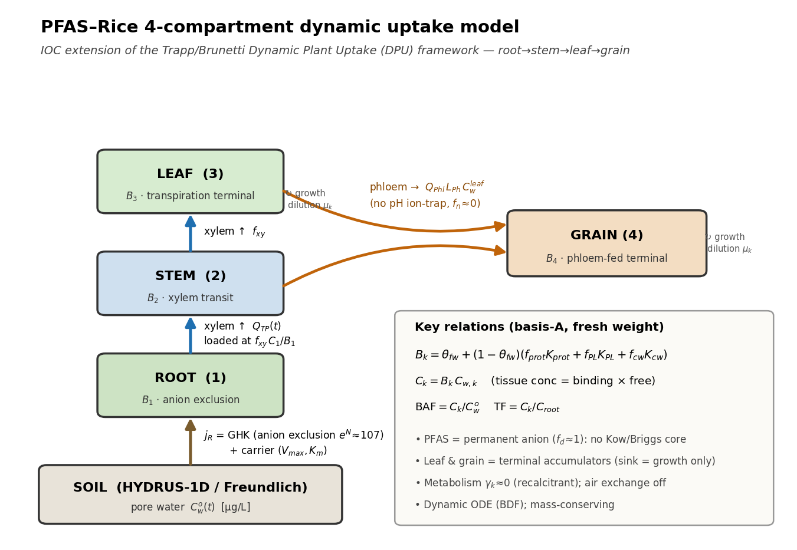
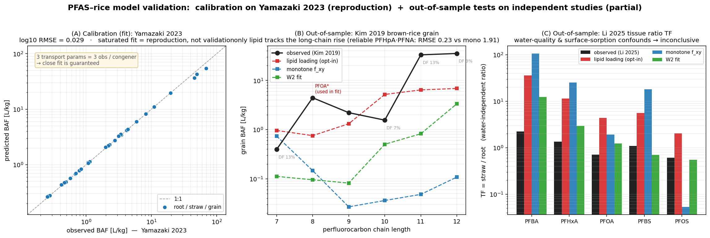
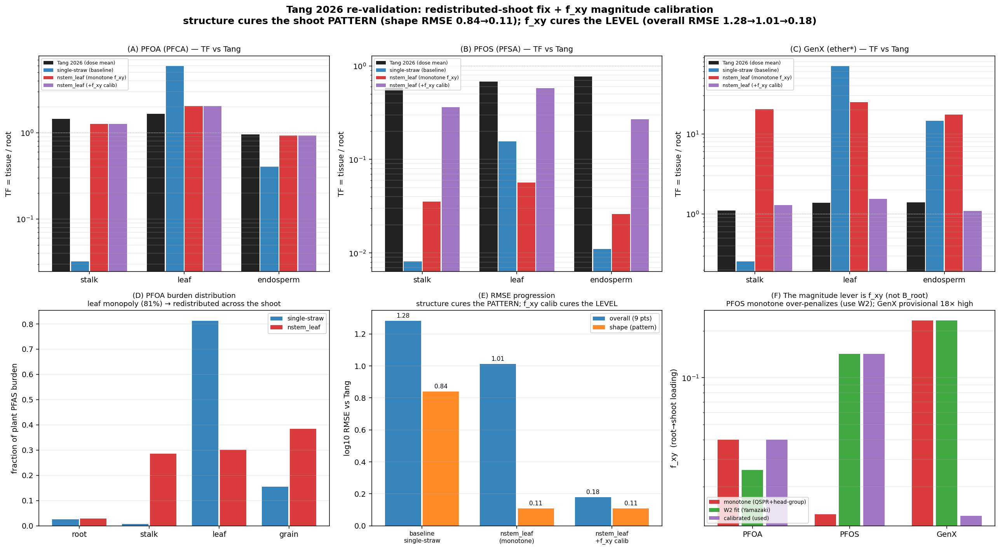
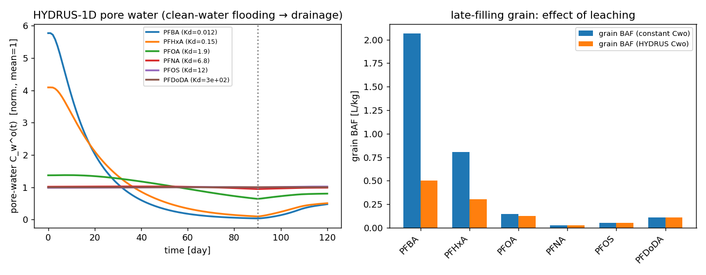

# PFAS–벼 흡수 모델 종합 문서 (기능·검증·데이터·실험·표기)

> 이 레포 전체를 한 눈에 보는 문서입니다 — **무엇을 하는가(기능)**, **얼마나 믿을 수 있는가(검증)**,
> **무엇이 부족한가(데이터 공백)**, **따라서 무슨 실험이 필요한가**, 그리고 **기호 정리(notation)**.
> 깊은 유도는 `docs/pfas_rice_compartmental_model.tex`, 세부 검증은 `docs/VALIDATION_*_KR.md`에 있습니다.



---

## 1. 한 줄 요약

벼(*Oryza sativa*)에서 **영구 음이온성 PFAS**의 생물축적을 푸는 **4구획 동역학(動力學) 흡수 모델**입니다.
Trapp/Brunetti의 **Dynamic Plant Uptake(DPU)** 틀을 **이온성 유기화합물(IOC)**로 확장했고, 토양 쪽은
**HYDRUS-1D**와 단방향 결합합니다. **결합(binding)은 독립 측정값으로 받치고, 이행(transport)은 한 현장
데이터(Yamazaki)에 보정**한 뒤, 다른 논문들로 **제한적 out-of-sample(OOS) 검증**을 한 단계입니다 —
*완전히 예측 검증된 모델은 아닙니다*.

---

## 2. 모델이 하는 일 (기능 설명)

### 2.1 과학적 핵심
- **PFAS = 영구 해리 음이온**(`pKa` 매우 낮음 → `f_d ≈ 1`). 중성화합물의 **Kow/Briggs 분배 코어가 적용 안 됨.**
- **뿌리 흡수 `j_R`는 하이브리드**: 막전위가 안쪽-음(−)이라 음이온을 **밀어내는** 전기확산(GHK; `e^N ≈ 107` 배제)
  **+** 이를 이겨내는 **포화 운반체**(Michaelis–Menten).
- **구획 간 이동 = 이류(advection)**: 물관(xylem) 상행 + 체관(phloem) 곡립행 — 거기에 조직별 **결합인자 `B_k`**.
- **잎·곡립은 종착 축적기(terminal accumulator)**: sink가 성장 희석뿐이고 성숙기에 `μ→0` → 정상상태가 없어
  최종 농도 = 시간적분/최종질량. **그래서 동역학(시간) 모델이 필수.**
- **곡립은 체관-급(phloem-fed)**: 약산 pH 이온트랩이 **적용 안 됨**(`f_n ≈ 0`) → 적재는 운반체/채널(`L_Ph`).
- 대사 `γ_k ≈ 0`(난분해), 공기교환 off(`K_AW ≈ 0`).

### 2.2 핵심 관계식 (basis-A, 신선중량 기준)
```
B_k = θ_fw + (1−θ_fw)·(f_prot·K_prot + f_PL·K_PL + f_cw·K_cw)     [L/kg fw]
C_k = B_k · C_w,k          BAF = C_k / C_w^o          TF = C_k / C_root
```
`(1−θ_fw)`는 **건중→신선 변환**(필수; 빼면 `B_k`를 ~3× 과대평가). 풀이는 **BDF stiff ODE**, 정확히 질량보존.

### 2.3 무엇을 입력하면 무엇이 나오나
| 입력(화합물) | 입력(시나리오/작물/토양) | 출력 |
|---|---|---|
| 사슬길이 `n_C`, 머리기, (pKa) → `K_PL/K_prot/K_cw, f_d, f_xy`(순서) | 공극수 `C_w^o(t)`, 증산 `Q_TP(t)`, 생장 `M_k(t)`, `E_m`, 조직조성 | 조직별 농도 `C_k(t)`, **BAF/TF/BCF**, 식물-부담 분포 |

화합물 입력의 정직한 경계: **결합·해리는 구조에서 예측되지만 `f_xy`(이행)는 보정 필요** (자세히 `docs/structure_input.md`).

### 2.4 모듈 맵
| 파일 | 역할 |
|---|---|
| `src/pfas_rice_plant_module_4pool_surf.py` | **canonical** 4구획 ODE 코어(+표면 plaque pool) |
| `src/pfas_rice_plant_module_nstem_leaf.py` | N-분절 줄기 + 잎 (증산 침착+보유; Tang 과이행 수정) |
| `src/soil_hydrus.py` | **실제 HYDRUS-1D** 엔진(phydrus) → `C_w^o(t), Q_TP(t)` (Method A) |
| `src/soil_paddy_redox_corrected.py` | Freundlich 논토양 흡착(레독스 보정) |
| `src/literature_params.py` | 문헌 QSPR/anchor(인용) — `Koc, K_PL, K_prot, f_d` + group-contribution |
| `src/pfas_structure.py` | **SMILES(구조) → Compound** 어댑터 (RDKit; read-across + QSPR) |
| `src/model_api.py` | UI-무관 wrapper: `simulate()`, `simulate_from_smiles()`, 드라이버/토양/biomon |
| `src/calibration.py` | Tier-1 보정(scipy) | 
| `app.py` + `src/plots.py` | Streamlit 시각화(식물/토양 누적 colormap, 5 노출모드) |

---

## 3. 검증 — 보정(calibration) vs 검증(validation)

> **핵심 구분**: "Yamazaki에 fit해서 RMSE 0.029로 재현"은 **검증이 아니라 재현**(포화 fit, congener마다
> 3파라미터=3관측). 진짜 검증은 **보정에 안 쓴** 데이터로의 예측입니다.
> ⚠️ **사전적(a-priori) 예측오차**(이론/QSPR monotone f_xy, 적합 아님)는 **log10 RMSE ≈0.84**
> (단일-straw, `reproduce_demo.py --rec`) / **≈0.95**(재배분-shoot, `validation/apriori_prediction.py`) —
> 즉 0.029과 ~29배 차이로 **표본외 예측은 안 됩니다**. sci-adk 엄밀성 심사가 이를 자동 판정(REFUTED):
> `sci_adk_review/FINDINGS.md` (영문 통합 manuscript: `docs/sci_adk_rigor_review.tex`).



| 데이터 | 성격 | 결과 | 해석 |
|---|---|---|---|
| **Yamazaki 2023** (일본 Andosol, congener별 청정수) | **보정(fit)** | log10 RMSE **0.029** | 재현 보장(포화 fit) — 예측 증거 아님 |
| **Kim 2019** (한국 논, 공극수↔현미 grain) | **OOS** | lipid RMSE **0.20**(신뢰점) / 0.48(전체) vs 기본모델 1.9–2.1 | **장쇄 grain 상승을 lipid 메커니즘만 예측** — 가장 강한 신호(단 grain-only·신뢰점 2개); §3.4 |
| **Li 2025** (톈진 현장) | OOS | inconclusive | group-water·표면흡착 교란으로 판별 불가 |
| **Tang 2026** (통제 5용량, 150일, root/stalk/leaf/chaff/endosperm) | **OOS(본격)** | 아래 표 | 지상부 구획·머리기·BCF 검증 |

### 3.1 Tang 2026 — 구조 수정 + f_xy 보정 (이 작업의 핵심)


| log10 RMSE (3화합물×3조직) | single-straw | nstem(구조) | +f_xy 보정 |
|---|---:|---:|---:|
| 전체(9점) | 1.28 | 1.01 | **0.18** |
| shape(조직 패턴) | 0.84 | **0.11** | 0.11 |

- **구조(재배분)가 패턴을, f_xy 보정이 절대 레벨을 치유** — 세 화합물 모두 order-of-magnitude 이내.
- 진단 확정: 레벨 레버는 **`f_xy`**(monotone PFSA 과벌점, GenX provisional)이고 **`B_root`는 Yamazaki로 확증**(불변).
- 상세: `docs/VALIDATION_TANG2026_NSTEM_KR.md`, `docs/VALIDATION_TANG2026_KR.md`, `docs/VALIDATION_KR.md`.

### 3.2 토양 결합 (Method A, 실제 HYDRUS-1D)


단쇄(약흡착)는 담수 중 거의 0으로 누출 → 상수-`C_wo` 가정이 grain/straw BAF를 ~2–4× 과대; 장쇄는 완충됨.

### 3.3 재검증(일관성/과적합) 점검 — `validation/revalidation_crosscheck.py`
이번 세션의 Tang-기반 변경(재배분 shoot 모델 + f_xy 재보정)이 **다른 데이터셋에서도 성립하는지(과적합 아닌지)**
교차 점검했습니다. *canonical 파라미터·기본 4pool은 불변*이라 이전 검증을 그대로 재실행하면 **수치가 동일**(테스트
111개가 이미 보증) — 의미 있는 건 일관성 점검입니다:

| 점검 | 결과 | 결론 |
|---|---|---|
| Yamazaki(보정) — 재배분 shoot이 재현하나 | nstem-W2 RMSE **0.34** ≈ 4pool-W2 0.37 | shoot 수정이 **보정데이터를 그대로 재현**(과적합 아님) |
| 〃 nstem-mono | 0.99 | 나쁜 건 **monotone f_xy** 탓이지 shoot 모델 탓 아님 |
| PFOS f_xy 재보정(0.013→0.142) | straw 0.26→2.37 (obs 4.35) | monotone PFSA f_xy 과소가 **Tang·Yamazaki 양쪽에서 확인**(교차 확증) |
| Kim grain(OOS) — shoot 모델 영향 | nstem-W2 0.96 < 4pool-W2 1.31 | 깨뜨리지 않고 약간 개선; 장쇄 grain 급등은 여전히 lipid 메커니즘 필요 |

→ **변경은 Tang에 과적합이 아니며, "monotone f_xy 과소" 진단은 교차 데이터셋으로 확증**됩니다.

### 3.4 표본외 일반화 — 자유음이온 모델은 실패하나 *메커니즘*은 일반화한다 (이 세션)
> `sci_adk_review/FINDINGS.md` §8 / runs `pfas-rice-oos-tang` · `pfas-rice-oos-lipid` · `pfas-rice-oos-multidataset` (모두 `sci-adk run` CLI).

기본(자유음이온) 모델은 **표본외에서 실패**(이론/QSPR f_xy로 Tang 2026 조직별 TF를 예측 → log10 RMSE
**1.23** vs in-sample 0.52 → **REFUTED**). **그러나** 장쇄 조사에서 찾은 **지질-촉진 로딩**(K_PL-gated;
Yamazaki에만 적합, 타깃 미적합)을 켜면 — *추가 적합이 아니라 올바른 메커니즘 추가* — 그 표본외 오차가
회복되며, 이는 **Tang 한정 우연이 아니라 여러 독립 데이터셋에 걸쳐 견고**합니다:

| 독립 데이터셋 (Yamazaki-적합, **재적합 없이** 전이) | lipid | mono(자유음이온) | W2 |
|---|---:|---:|---:|
| **Tang 2026** 조직별 TF (dw) — 깨끗 | **0.52** | 1.23 | — |
| **Kim 2019** 곡립 BAF (PFOA 제외) — 깨끗 | **0.48** | 2.05 | 1.07 |
| **Kim 2019** 곡립, 신뢰(DF≥15%) | **0.20** | 1.92 | 1.44 |
| Li 2025 TF — 현장 교란(사전등록 inconclusive) | 혼합 | 혼합 | 혼합 |

→ 지질이 **두 깨끗한 데이터셋(Tang·Kim) 모두에서 명확히 우세**(서로 다른 국가·엔드포인트), mono/W2가
구조적으로 놓치는 Kim 곡립 **장쇄 RISE**를 지질만 포착 — **프로젝트의 첫 강한 교차데이터셋 표본외 예측
성공**(Chen2025 막분배 단조증가가 독립 corroborate). 정직한 잔여: GenX(ether) 과대(별개 조건의존),
Li 현장 교란, Kim 장쇄 저-DF. 지질 로딩은 **opt-in 유지(기본 off)** — core 불변.

### 3.5 정직한 결론
이 모델은 **(a) 결합을 독립 측정으로 받치고 (b) 이행을 Yamazaki로 보정한 뒤 (c) 표본외 검증으로
*자유음이온 core는 예측 실패, 지질 메커니즘은 다중 데이터셋에 걸쳐 일반화*함을 확인한 단계**입니다.
*기본 모델은 완전한 예측 검증이 아니며* 가장 큰 공백은 깨끗한 **조직·시간 분해 독립 데이터**입니다(§4–5);
다음 구조적 단계는 검증된 지질 메커니즘(+2-pool root)을 core에 승격할지의 결정입니다.

---

## 4. 부족한 데이터 (공백)

> 출처: `docs/literature_db/Gap_Analysis.csv`(C1–C6), `docs/data_inventory_and_gaps.md`.

| # | 공백 | 범주 | 영향 | 비고 |
|---|---|---|---|---|
| 1 | **조직·시간 분해 BAF/TF** (root→stem→leaf→husk→grain, 짝지은 공극수) | C1 | **최대 공백** — 단일 포화 fit 문제를 깨는 열쇠 | 온실 시계열 필요 |
| 2 | **`K_cw`** 세포벽 분배계수 (직접 측정) | C4 | 문헌 계수 자체가 없음(현재 anchor) | GAP A |
| 3 | **운반체 vs 채널 분리** (`V_max/K_m` vs `P_d^eff`) | C2 | BAF만으로 분리 불가(식별성) | 억제제 실험 |
| 4 | **현장 뿌리 막전위 `E_m`** | C5 | GHK 배제항 직접 검증 불가 | 미세전극 |
| 5 | **혐기/담수(음의 Eh) 흡착 등온선** | C3 | 담수 레독스가 `C_w^o` 지배 | 모두 호기 데이터뿐 |
| 6 | **per-congener 공극수**(현장) | C1/C3 | Li는 group-water | 신뢰 BAF 분모 |
| 7 | **ether/sulfonamide 토양 Koc** (`KOC_ETHER_LOG_OFFSET=0`) | C3 | PFECA/sulfonamide 토양흡착 측정 없음 | 구조 어댑터 |
| 8 | **ether/sulfonamide 결합 K_PL** (ether 항이 GenX 단일 anchor) | C4 | sulfonamide slope 없음 | 구조 어댑터 |
| 9 | **GenX/F-53B/6:2 FTS 벼 데이터** | C1 | replacement 매우 희박 | 표준품 확보됨 |
| 10 | **초장쇄(PFDoDA+) 분석 신뢰성** | C1 | MQL 부근 | 데이터 확장 |

---

## 5. 따라서 해야 하는 실험 (공백 → 실험 매핑)

| 우선 | 실험 | 해소하는 공백 | 산출 → 모델 |
|---|---|---|---|
| **HIGH** | **온실 paddy 시계열**(환경+고용량, 2품종, 월별, root/straw/husk/brown/polished 분리 + 짝지은 공극수) | 1, 6, 9 | 진짜 OOS 검증 + `f_xy`/`L_Ph` 절대 스케일 |
| **HIGH** | **혐기 배치 흡착**(글러브박스, 제어 Eh; Fe(II)·PFAS 탈착 추적) | 5 | 담수 `C_w^o` 정확화(HYDRUS 입력) |
| **HIGH** | **억제제 ± 농도열 뿌리흡수 assay** | 3 | 운반체 vs 채널 분리(`V_max/K_m` vs `P_d`) |
| MED | **물관 삼출액 `f_xy`**(근압 exudate [PFAS]/[근수]) + **체관 `L_Ph`**(이삭자루) | 1 | 이행 파라미터 직접(현재 1점 fit) |
| MED | **뿌리 세포벽 분획 배치 흡착**(pectin/hemicellulose) | 2 | 직접 `K_cw`(GAP A) |
| MED | **현장 微전극 `E_m`** | 4 | GHK 배제항 검증 |
| MED | **ether-PFCA·sulfonamide 배치 Koc + K_MW** (GenX/ADONA/FOSA) | 7, 8 | ether/sulfonamide fragment 항 다중 anchor |

---

## 6. Notation 정리 표

> 단위 규약: 시간 **day**, 수용액 농도 **µg/L**, 조직 농도 **µg/kg(fw)**, 질량 **kg**, 유량 **L/day**.
> 기호는 `docs/pfas_rice_compartmental_model.tex`와 1:1 대응.

### 6.1 상태·구획
| 기호 | 의미 | 단위 |
|---|---|---|
| `k = 1,2,3,4` | 구획: root, stem, leaf, grain(fruit) | – |
| `C_k(t)` | 구획 k 조직 농도 | µg/kg fw |
| `C_w,k` | 구획 k 자유(수상) 농도 = `C_k/B_k` | µg/L |

### 6.2 Tier-0 — 입력/기지값
| 기호 | 의미 | 단위 | 출처 |
|---|---|---|---|
| `C_w^o(t)` | 토양 공극수 자유 농도(노출) | µg/L | HYDRUS/Freundlich |
| `Q_TP(t)` | 증산=뿌리 물흡수 | L/day | forcing_rice (측정) |
| `Q_Phl` | 체관 유량 | L/day | – |
| `M_k(t)` | 구획 신선질량 | kg | growth_rice (ORYZA) |
| `μ_k = (dM_k/dt)/M_k` | 성장 희석률 | 1/day | – |
| `N = zF·E_m/RT` | 무차원 막전위(GHK); `e^N≈107`=배제 | – | – |
| `E_m` | 뿌리 막전위 | mV (~−120) | Wang 1994 |
| `f_d` / `f_n` | 해리(음이온) / 중성 분율 | – | `f_d≈1, f_n≈0` (Goss 2008) |
| `γ_k` | 대사율 | 1/day | `≈0` |
| `θ_fw` | 신선중량 수분 분율 | – | rice_tissue_params |
| `f_prot, f_PL, f_cw` | 단백질/인지질/세포벽 **건중** 질량분율 | – | rice_tissue_params |

### 6.3 Tier-1 — BAF로 식별(보정 대상)
| 기호 | 의미 | 단위 | 비고 |
|---|---|---|---|
| `B_k` | 결합인자 (`C_k=B_k·C_w,k`) | L/kg fw | basis-A |
| `f_xy` | 뿌리→물관 적재계수(TSCF 유사), ∈(0,1] | – | **fitted**; 머리기 의존 |
| `L_Ph` | 체관 적재계수(곡립) | – | **fitted** |
| `κ_d` (`kappa_d`) | 이온 막전도(lumped) | L/(day·kg) | **fitted** |
| `φ` | 체관 재순환 분율 | – | – |

### 6.4 Tier-2 — 운반체 동역학(억제제 데이터 필요)
| 기호 | 의미 | 단위 |
|---|---|---|
| `V_max,in / K_m,in` | 운반체 유입 Michaelis–Menten | µg/(kg·day) / µg/L |
| `V_max,out / K_m,out` | 운반체 유출 | 〃 |
| `P_d^eff` | 채널(전기확산) 유효 투과도 | – |

### 6.5 Tier-3 — 결합/분배 QSPR(사슬길이 분해)
| 기호 | 의미 | 단위 | 출처 |
|---|---|---|---|
| `K_PL` | 인지질/막–물 분배 | L/kg lipid | Chen 2025 K_MW(측정) |
| `K_prot` | 단백질–물 분배 | L/kg prot | Zhou 2025 투석(측정) |
| `K_cw` | 세포벽–물 분배 | L/kg | **placeholder**(문헌 없음) |
| `K_surf` | 뿌리 표면/plaque 흡착 | L/kg | 현장 의존(기본 0) |

### 6.6 토양
| 기호 | 의미 | 단위 |
|---|---|---|
| `Koc` | 유기탄소-정규화 분배 | L/kg |
| `K_F, n` | Freundlich 용량·지수 (`S=K_F·C_w^n`) | – |
| `Kd = Koc·f_oc` | 선형 분배계수 | L/kg |
| `R = 1+ρKd/θ` | 지연계수 | – |
| `f_oc` | 유기탄소 분율 | – |

### 6.7 출력 지표 + 구조 어댑터
| 기호 | 의미 |
|---|---|
| `BAF = C_k/C_w^o` | 생물축적계수(공극수 기준) |
| `TF = C_k/C_root` | 이행계수(분모-무관) |
| `BCF = C_rice/C_soil` | 생물농축계수(토양 기준) |
| `n_perfluoroC, head_group, n_ether_O` | 구조 descriptor(SMILES) |
| `KPL_ETHER_LOG_OFFSET = −0.49` | ether당 K_PL 보정(GenX anchor) |
| `KOC_ETHER_LOG_OFFSET = 0` | ether당 Koc 보정 **(GAP)** |
| `FXY_HEADGROUP_LN_OFFSET` | 머리기 f_xy 오프셋(sulfonate −1.1, ether −0.7) |

---

## 7. 재현 방법
```bash
pip install -r requirements.txt
python reproduce_demo.py                          # Yamazaki 보정 (log10 RMSE 0.029)
python validation/validation_summary.py           # (A)Yamazaki/(B)Kim/(C)Li 그림
python validation/tang2026_nstem_validation.py     # Tang 구조+f_xy 보정 그림 (RMSE 0.18)
python validation/revalidation_crosscheck.py       # 변경의 교차 일관성(과적합) 점검
python validation/hydrus_coupled_run.py            # 실제 HYDRUS-1D 토양→식물 (엔진 빌드 시)
pip install -r requirements-structure.txt          # RDKit (구조 입력)
python src/pfas_structure.py                        # SMILES → descriptors → Compound
streamlit run app.py                                # 시각화 도구
pip install pytest && pytest                        # 111 passing
```

**관련 문서**: 유도 `pfas_rice_compartmental_model.tex` · 검증 `VALIDATION_KR.md`/`VALIDATION_TANG2026*_KR.md`
· 데이터/공백 `data_inventory_and_gaps.md`+`literature_db/Gap_Analysis.csv` · 구조입력 `structure_input.md`
· GAP A/B `DELIVERABLE_GAP_A_Kcw.md`/`DELIVERABLE_GAP_B_fxy.md` · 시각화 `visualization_tool.md`.
