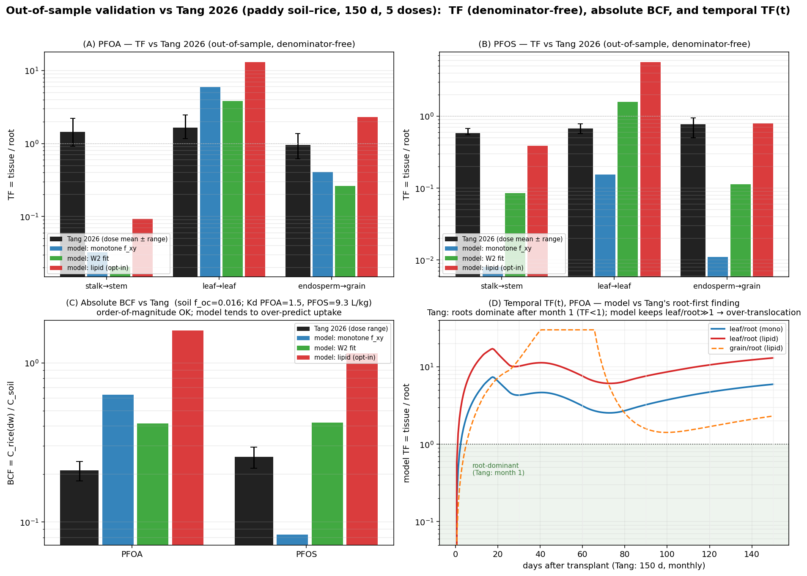

# Tang 2026 독립 검증 (본격 OOS) — 한국어

> **한 줄 요약** — Tang et al. 2026(통제 용량, 150일 전 생장주기 논-벼 시스템; PFOA/PFOS/**GenX**)으로 모델을
> **out-of-sample(OOS) 검증**했습니다(TF·절대 BCF·시계열 TF(t) 3축, PFOA·PFOS·GenX). 이 과정에서 **GenX(ether-PFAS)를
> 모델에 추가**(이제 13 congener; §7). 모델 빌드엔 이 논문의 **head-group *부호*만** 썼으므로 크기는 진짜 OOS입니다.
> **맞는 것**: 이삭 이행 order-of-magnitude(lipid·PFOS 0.80 vs 0.77), PFSA<PFCA 머리기 순서, **GenX가 가장 이동성**이라는 방향,
> TF 용량-무관성, PFOA·PFOS **절대 BCF 크기**(W2 ~2배 이내). **틀리는 것**: 모델 **줄기 칸이 비어 stalk를 크게 과소**,
> **잎은 과대**(이동성 큰 **GenX에서 극심**), **초기 뿌리 우세(root-first)를 재현 못 함** — Tang이 모델의 **지상부 구획 분배(과이행)
> 약점**을 정량적으로 짚어줍니다(→ 다구획 줄기 nstem이 개선 방향).



*그림(6패널): (A·B·C) PFOA·PFOS·**GenX**의 TF(조직/뿌리) — Tang(검정, 5용량 평균±범위) vs 모델 3변형(monotone/W2/lipid),
분모-무관 직접 비교. (D) 절대 BCF=C_rice/C_soil — 토양 Kd(Koc·f_oc, f_oc=0.016)로 변환해 Tang 범위와 비교.
(E) 시계열 TF(t) — 모델 leaf/root가 전 기간 1보다 커 Tang의 "1개월 후 뿌리 우세(root-first)"를 재현 못 함(과이행).
(F) 이행 레버 f_xy(머리기×사슬) — GenX(ether,단쇄) 0.23 > PFOA 0.04 > PFOS 0.013, Tang의 강한 GenX 상향 이동과 방향 일치.
생성: `python validation/tang2026_validation.py`.*

---

## 1. 받은 자료와 그 구조 (Tang 2026, JHM 502:141017)
- **본문 PDF + SI(mmc1.docx)** 전체를 받아 추출했습니다.
- 실험: Nipponbare 벼, **150일(5개월) 전 생장주기, 월별 샘플링**, 연속 담수 논토양에 PFOA/PFOS/GenX를
  **5용량(0.1·1·10·50·100 µg/g, 토양 기준)** 으로 처리.
- 조직: **root / stalk / leaf / chaff / endosperm** (5구획).
- 정의(본문 Eq.1–5): **BCF = C_rice/C_soil**, **TF_x = C_x/C_root**.
- 수치 데이터: SI **Table S7(BCF)·S8(TF)** 에 5용량 endpoint 전체 → `docs/literature_db/raw_si/tang2026_doseresponse.csv`로 전사.
- 시간 차원: SI **Table S6** 가 "시간(월) 효과 p<0.001, 농도×시간 상호작용 p<0.001"을 보고(시계열은 존재).
  월별 원시 농도는 본문 Fig.4a 그림(용량별 y-축 상이·조밀)에만 있어 **수치 디지타이즈는 신뢰 불가** → 본문의 명시적
  정성 주장("1개월 후 뿌리 우세")으로 모델 TF(t)를 판별했습니다(§5).

## 2. 왜 OOS 검증이 가능한가 + 노출 기준 우회
- 모델 빌드에 **이 논문의 head-group 부호만** 사용(`f_xy(PFSA)=f_xy(PFCA)·e^{−1.1}`) → **TF/BCF 크기는 fit에 안 씀 = OOS.**
- **노출 기준 문제 우회**: Tang 노출은 **토양 슬러리 µg/g**(공극수 µg/L 아님)이지만, **TF=조직/뿌리는 분모(토양 vs 공극수)와 무관**합니다.
  따라서 토양→공극수 변환 없이 **모델 TF를 Tang TF와 직접 비교**할 수 있습니다(가장 깨끗한 시험). 매칭: Tang stalk↔모델 stem,
  leaf↔leaf, endosperm↔grain(모델은 껍질·배유를 한 grain 칸으로 묶음).

## 3. 정량 결과 — TF(조직/뿌리), PFOA·PFOS (5용량 평균)

| PFAS | 조직 | Tang 평균 | monotone | W2 | lipid |
|---|---|---:|---:|---:|---:|
| PFOA | stalk→stem | 1.45 | 0.03 | 0.02 | 0.09 |
| PFOA | leaf→leaf | 1.66 | 5.95 | 3.83 | 13.0 |
| PFOA | endosperm→grain | 0.95 | 0.41 | 0.26 | **2.31** |
| PFOS | stalk→stem | 0.58 | 0.01 | 0.09 | 0.39 |
| PFOS | leaf→leaf | 0.68 | 0.16 | 1.58 | 5.66 |
| PFOS | endosperm→grain | 0.77 | 0.01 | 0.11 | **0.80** |
| **GenX**(ether) | stalk→stem | 1.10 | 0.25 | 0.25 | 0.17 |
| **GenX**(ether) | leaf→leaf | 1.38 | 70.9 | 70.9 | 47.2 |
| **GenX**(ether) | endosperm→grain | 1.39 | 14.5 | 14.5 | 10.3 |

| log10 RMSE (3화합물×3조직) | monotone | W2 | lipid |
|---|---:|---:|---:|
| 전체(stalk 포함) | 1.28 | 1.04 | **0.88** |
| leaf+grain만(깨끗한 매칭) | 1.17 | 0.93 | **0.90** |

**읽는 법:**
- ✅ **이삭(endosperm→grain), PFOA·PFOS**: lipid가 **PFOS 0.80 ≈ Tang 0.77** 로 거의 일치, PFOA 2.31(약간 과대). monotone/W2는 과소.
  → 장쇄 lipid 메커니즘이 *독립 데이터*에서도 grain 이행을 order-of-magnitude로 맞춤(Kim 2019 신호와 일관).
- ✅ **머리기 순서**: PFSA(PFOS)<PFCA(PFOA) TF — Tang의 PFOS/PFOA stalk TF 0.26과 부호 일치. **GenX(ether)는 f_xy 0.23으로
  가장 이동성**(PFOA 0.04 > PFOS 0.013) → Tang의 "GenX가 가장 강한 상향 이동"과 **방향 일치**(패널 F).
- ✅ **용량 무관성**: 모델 TF는 (선형이라) 용량 무관, Tang TF도 대체로 용량 무관(특히 PFOS) — 구조적 일치.
- ❌ **줄기(stalk→stem)**: 모델 stem TF 0.01–0.39 vs Tang 0.58–1.45 — **모든 변형이 크게 빗나감**(줄기 칸이 고-증산 통과 칸).
- ❌ **잎(leaf→leaf) 과대**: 모델 leaf가 물관 종착 sink라 과축적. **GenX에서 극심**(모델 47–71 vs Tang 1.38) — 이동성이 큰
  ether일수록 과이행이 심해짐 → §6의 구조적 약점을 가장 강하게 드러냄.

## 4. 절대 BCF (정량) — Fig.3 + Table S7  [그림 패널 D]
이제 토양→공극수 변환을 넣어 **절대 BCF=C_rice/C_soil** 을 비교했습니다. Tang 토양 OM=27.4 g/kg(Table S2)→
**f_oc≈0.016**. 모델은 사슬길이 Koc QSPR로 Kd(PFOA 1.5, PFOS 9.3, GenX 0.12 L/kg)를 만들고
`BCF = [Σ M·BAF / Σ M·(1−θ_fw)] / (Kd+θ_g)` (건중 전식물 BAF ÷ 토양 분배)로 산출:

| BCF | Tang(0.1–100) | monotone | W2 | lipid |
|---|---|---:|---:|---:|
| PFOA | 0.18–0.24 | 0.63 | **0.42** | 1.60 |
| PFOS | 0.22–0.30 | 0.08 | **0.42** | 1.15 |
| **GenX**(ether) | 0.36–0.52 | 21.3 | 21.3 | 16.6 |

- ✅ **PFOA·PFOS는 order-of-magnitude 일치** — 모델 0.4–1.6 vs Tang 0.2–0.3, **W2가 ~2배 이내**로 최근접. 약간 과대(잎 과적재와 일관).
  토양 Kd(독립 QSPR)+식물 흡수의 **전체 사슬이 맞는 크기**를 주며, Tang Fig.3(담수 우세·BCF 낮음)과도 방향 일치.
- ❌ **GenX는 ~40배 과대**(21 vs 0.4): 두 원인 — (i) ether 토양 Kd를 단쇄 PFCA로 근사(0.12 L/kg)해 **과소→흡수 과대**,
  (ii) 잎 과이행. Tang은 GenX BCF가 PFOA와 비슷(0.4 vs 0.2)인데, 모델은 GenX 토양 잔류를 너무 낮게 봐 가용성을 과대평가.
  → **ether 전용 Koc QSPR**이 필요(단쇄 PFCA 근사는 과소; §7).

## 5. 시계열 TF(t) (정량) — Fig.4a + 본문  [그림 패널 E]
Tang 본문: **"1개월 후 PFOA·PFOS는 모든 농도에서 뿌리에 우세 축적, 지상부보다 유의하게 높음"**(즉 초기 root>shoot),
이후 지상부가 차오름(수확기 TF≈1–2.5). 이를 **모델의 TF(t)=C_x(t)/C_root(t) 궤적**으로 엄밀히 비교:

- ❌ **모델은 leaf/root가 전 기간 7–15 (>1)** — **초기 뿌리 우세를 전혀 재현 못 함.** Tang은 1개월 후 root>shoot인데
  모델은 처음부터 leaf≫root → **지상부로 과이행(over-translocation).**
- 이는 §3의 수확기 TF_leaf 과대(3–13 vs 1.66)와 같은 뿌리: 모델의 **잎이 물관 종착 sink로 과축적**하고 **뿌리가 과소**.
- **정량 월별 비교는 보류**: Tang 월별 원시값은 Fig.4a 그림(용량별 y-축 상이·막대 조밀)에만 있어 **신뢰성 있는 수치
  디지타이즈가 불가**합니다(가짜 정밀도 회피). 대신 본문의 명시적 정성 주장(root-first)으로 모델을 판별했습니다.

## 6. 정직한 결론
**Tang 2026은 (Li처럼 inconclusive가 아니라) 모델을 진짜로 검증·판별**합니다 — 무엇이 맞고 무엇이 틀리는지를 정량적으로 보여줍니다:

- ✅ **맞는 것**: 이삭(grain) 이행 order-of-magnitude(특히 lipid·PFOS 0.80 vs 0.77), **PFSA<PFCA 머리기 순서**,
  **GenX(ether)가 가장 이동성**이라는 방향, **TF 용량-무관성**, **PFOA·PFOS 절대 BCF 크기**(W2 ~2배 이내), 담수-우세 분배 방향.
- ❌ **틀리는 것(= 다음 개선 우선순위)**: 모델의 **지상부 구획 분배가 구조적으로 부정확** —
  (i) **줄기 칸이 비어 stalk를 크게 과소**, (ii) **잎이 과대**(이동성 큰 **GenX에서 극심**: 47–71 vs 1.4), (iii) **초기 뿌리 우세(root-first)를 재현 못 함**.
  셋 다 한 원인: **물관 종착 잎으로의 과이행 + 단일·통과형 줄기 칸**. (추가로 GenX는 **ether 토양 Kd 과소** → BCF ~40배 과대.)
  → 개선 방향은 **다구획 줄기 + 잎/줄기 적재 재배분**으로 정량적으로 좁혀집니다.
  **→ 이 수정은 이제 구현·재검증 완료(다음 항목): `docs/VALIDATION_TANG2026_NSTEM_KR.md`.**

> **UPDATE (지상부 과이행 수정 — `docs/VALIDATION_TANG2026_NSTEM_KR.md`)**: 위 ❌의 (i)(ii)를
> `src/pfas_rice_plant_module_nstem_leaf.py`(다구획 줄기 + 증산 침착·보유 재배분)로 **구조적으로 치유**했습니다 —
> 빈 줄기·잎 폭주가 사라지고 조직 **패턴**이 Tang과 일치(**shape RMSE 0.84→0.11**), **PFOA 세 조직 정량 일치**
> (stalk 0.03→1.27, leaf 5.95→2.04, grain 0.41→0.93). 남은 오차는 congener 간 **절대 레벨**(`f_xy·B_root` 스프레드 →
> PFOS 과소·GenX 과대)로, 구조가 아닌 **보정** 문제로 좁혀졌습니다.

## 7. GenX(ether-PFAS) 추가 — 이번에 구현
- **모델에 GenX 추가**(이제 13 congener; `build_parameters.py` → `params/parameters.json`): `simulate("GenX")` 작동.
  - `K_PL=117.5`(Chen 2025 HFPO-DA **측정값**; log K_MW 2.07≈PFPeA 2.02 → 결합은 PFPeA급), `K_prot/K_cw`≈PFPeA(Zhou 2025 GenX 없음),
    `f_xy = PFCA(nPFC5) 0.470 × exp(−0.7)(ether offset) = 0.233` → PFOA(0.04)보다 이동성 큼.
  - **PROVISIONAL**(BAF 보정 안 됨)로 명시. Tang OOS는 위 결과대로 방향은 맞고 크기는 과대.

## 8. 남은 작업
- **정량 월별 시계열 RMSE** — SI엔 raw 시계열 없음(Table S6는 ANOVA뿐, 월별값은 Fig.4a 그림). 본문 **Data Availability =
  "Data will be made available on request"** → **교신저자 Baoliang Chen(blchen@zju.edu.cn, ZJU; ORCID 0000-0001-8196-081X)** 에게
  Fig.4a 원시데이터(월×조직×용량 농도)를 요청하면 시간축 RMSE 산출 가능.
- **GenX ether 전용 Koc** — 현재 단쇄 PFCA 근사로 Kd 과소(BCF 40배 과대). ether-PFAS Koc QSPR/측정값으로 교체 필요.
- **모델 개선** — 위 ❌(지상부 구획 과이행)을 nstem 다구획 줄기 + 잎/줄기 재배분으로 수정 후 Tang TF로 재검증
  **✅ 완료** (`docs/VALIDATION_TANG2026_NSTEM_KR.md`, `src/pfas_rice_plant_module_nstem_leaf.py`,
  `validation/tang2026_nstem_validation.py`): 지상부 패턴 치유(shape RMSE 0.84→0.11), PFOA 정량 일치.
  **남은 보정**: congener 절대 레벨(`f_xy·B_root` — PFOS/GenX), 시계열 TF(t) 재검증.

## 9. 재현
```bash
python build_parameters.py                    # GenX 포함 13 congener 재생성
python validation/tang2026_validation.py      # TF×3 + BCF + 시계열 + f_xy 그림
#   -> validation/figures/tang2026_validation.png
```
데이터: `docs/literature_db/raw_si/tang2026_doseresponse.csv`(SI S7/S8 전사, PFOA/PFOS/GenX). 관련: `docs/VALIDATION_KR.md`.
